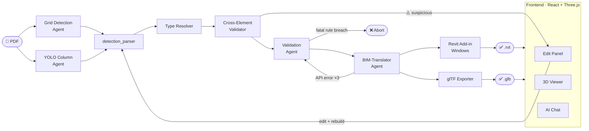

# MCC-Amplify-AI v3

**Agentic PDF-to-BIM Pipeline** — Converts architectural floor plans (PDF) into Revit `.rvt` models using a self-correcting, decentralized multi-agent system.

Built for Main Contractor DfMA workflows under **Singapore SS CP 65 / BCA DfMA Advisory 2021** standards.

---

## Agentic Workflow



---

## Architecture: Decentralized Agents

Each agent is a **fully isolated unit** with its own private toolset and memory database. No shared `tools.py` exists between agents.

| Agent | Directory | Private Tools | Private Memory | Responsibility |
|---|---|---|---|---|
| **Grid Detection** | `grid-detection-agent/` | `tools.py` — render, detect, verify, margin-scan | `grid_memory.db` | Extract structural grid labels from PDF |
| **Column Detection** | `yolo_detection_agents/` | `column_agent.py` — YOLOv11 + tiled sliding-window + torchvision NMS | `detections.db` | Detect column bounding boxes (single class) |
| **Type Resolution** | `type_resolution_agents/` | `column_resolver.py` — OCR scan, geometric fingerprint, cluster propagation, spatial k-NN | — | Resolve type mark, shape, and estimated dimensions per detection |
| **Cross-Element Validation** | `cross_element_validator/` | geometric_plausibility, overlap_conflict, grid_intersection, neighbourhood_consensus | — | Flag misclassified detections; quarantine to EditPanel (non-blocking) |
| **Validation** | `validation/` | `geometry_checker`, `loop_closer`, `standard_thickness_lookup`, `memory_io` | `memory.sqlite` | DfMA rule enforcement + wall topology repair |
| **BIM-Translator** | `translator/` | `coordinate_transformer`, `revit_schema_mapper`, `revit_api_client`, `memory_io` | `memory.sqlite` | Pixel→mm, Revit JSON mapping, API dispatch |

### BaseAgent Contract

All agents inherit from `base_agent.BaseAgent`:

- **`@memory_first`** — queries the agent's private memory *before* `_process()` runs; injects correction hint into payload
- **`run(payload)`** — single public entry point; wraps `_process()` with error capture and SQLite run logging
- **`_load_agent_tools(label, path)`** — loads a private `tools.py` under a unique `sys.modules` key, preventing namespace collisions when both agents run in the same process
- **`_save_correction(...)`** — persists successful fixes so future runs apply them proactively via `@memory_first`

### Memory Schemas

**Validation Agent** (`validation/memory.sqlite`):

| Column | Description |
|---|---|
| `feature_signature` | Drawing class — e.g. `"Dense Grid, Rectangular Columns"` |
| `element_type` | `wall` / `column` / `grid` / `opening` |
| `rule_code` | `W1` / `C2` / `G1` / … |
| `original_value` | Value before correction |
| `corrected_value` | DfMA-compliant value applied |
| `rule_applied` | Human-readable rule reference |
| `success_count` | Incremented on each reuse |

**BIM-Translator Agent** (`translator/memory.sqlite`):

| Column | Description |
|---|---|
| `element_type` | `column` / `wall` / `door` / `window` |
| `family_name` | e.g. `M_Concrete-Rectangular-Column` |
| `type_name` | e.g. `800 x 800mm` |
| `parameters_json` | `{"b": 800, "d": 800, "Column Height": 3000}` |
| `revit_outcome` | `success` / `failure` |
| `error_message` | Captured C#/.NET exception text |
| `correction_applied` | What adjustment resolved the failure |
| `success_count` | Incremented on each successful reuse |

Both memories also write `memory.json` as a human-readable **Lessons Learned** log.

---

## Project Structure

```
mcc-amplify-v3/
├── backend/
│   ├── base_agent.py          # Abstract BaseAgent + @memory_first decorator
│   ├── controller.py          # Pipeline orchestrator (Stage 1 → 1b → 1c → 2 → 3)
│   ├── server.py              # FastAPI server — REST endpoints + WebSocket chat
│   └── gltf_exporter.py      # Transaction JSON → GLB (trimesh)
│
├── grid-detection-agent/      # Stage 1a — Grid label detection (SEA-LION vision)
│   ├── agent.py               # Render → detect → verify → margin-scan → reconcile
│   └── tools.py               # PDF render, vision detect, zoom margin, memory CRUD
│
├── yolo_detection_agents/     # Stage 1a — Column detection (YOLOv11)
│   ├── base_yolo_agent.py     # Lazy model load, render_pdf_page(), tiled inference
│   ├── column_agent.py        # YOLOColumnAgent — single class, page image cached
│   └── weights/
│       └── column-detect.pt   # Trained YOLOv11 weights
│
├── type_resolution_agents/    # Stage 1b — Type resolution per element
│   ├── base_resolver.py       # BaseTypeResolver — OCR scan, cluster propagation, spatial k-NN
│   └── column_resolver.py     # ColumnTypeResolver — C1/RC1 OCR tags, Hough circle, aspect ratio
│
├── cross_element_validator/   # Stage 1c — Cross-element misclassification detection
│   ├── validator.py           # CrossElementValidator — orchestrates all checks, quarantine
│   ├── quarantine.py          # QuarantineManager — non-blocking flagging → EditPanel
│   └── checks/
│       ├── geometric_plausibility.py   # bbox squareness vs expected element shape
│       ├── overlap_conflict.py         # cross-type IoU (column inside wall bbox)
│       ├── grid_intersection.py        # distance penalty from nearest grid node
│       └── neighbourhood_consensus.py  # spatial outlier in column grid
│
├── validation/                # Stage 2 — DfMA Validation Agent
│   ├── agent.py               # ValidationAgent
│   ├── tools.py               # geometry_checker, loop_closer, standard_thickness_lookup
│   └── memory.sqlite          # conflict_resolutions, validation_runs
│
├── translator/                # Stage 3 — BIM-Translator Agent
│   ├── agent.py               # BIMTranslatorAgent (self-correction loop ×3)
│   ├── tools.py               # coordinate_transformer, revit_schema_mapper, revit_api_client
│   └── memory.sqlite          # api_success_patterns, translation_runs
│
├── revit_server/              # Windows Revit Add-in service (port 5000)
│   └── RevitService/
│       ├── ApiServer.cs       # HTTP listener — POST /build-model → raw .rvt bytes
│       └── ModelBuilder.cs    # Build Revit model from Transaction JSON
│
└── frontend/                  # Vite + React UI
    └── src/
        ├── components/
        │   ├── Layout.jsx       # Three-column workspace
        │   ├── UploadPanel.jsx  # Upload, status poll, downloads
        │   ├── Viewer.jsx       # Three.js 3D GLB viewer
        │   ├── EditPanel.jsx    # Element patch + quarantine review
        │   └── ChatPanel.jsx    # WebSocket AI chat
        └── run_frontend.sh      # → http://localhost:5173
```

---

## 5-Step Implementation

### Step 1 — Initialize Workspace
Created the decentralized directory structure with `validation/` and `translator/` each containing their own isolated `tools.py` and `memory.sqlite`. `base_agent.py` at root provides the shared contract without sharing any tool logic.

### Step 2 — Legacy Extraction
`seed_memory.py` extracts DfMA rules and Revit family mappings from `mcc-amplify-ai` (v1) and pre-populates both agent memories before the first live run:
- 9 geometric conflict resolutions → `validation/memory.sqlite`
- 11 Revit API success/failure patterns → `translator/memory.sqlite`

### Step 3 — Template BaseAgent
`base_agent.py` enforces the agent contract: the `@memory_first` decorator, private tools loading via `_load_agent_tools()`, and universal SQLite run logging — so every subclass only needs to implement `_process()`.

### Step 4 — Isolated Implementation
**Validation Agent**: `geometry_checker` runs 9 DfMA rule checks against SS CP 65, `loop_closer` snaps open wall endpoints to close floor plan boundaries, `standard_thickness_lookup` provides the Singapore dimension standards table. Raises `refinement_request` for uncorrectable issues.

**BIM-Translator Agent**: `coordinate_transformer` converts pixel→mm via grid-derived scale, `revit_schema_mapper` produces the full Revit Transaction JSON (levels / grids / walls / columns / doors / windows / floors / ceilings), `revit_api_client` dispatches to the Windows Add-in with a 3-attempt self-correction loop.

### Step 5 — Controller Logic
`controller.py` runs grid and column detection **in parallel** (`ThreadPoolExecutor`), normalises outputs via `detection_parser`, enriches payloads with project context at each handoff, and implements the refinement loop: BIM-Translator failure → re-run ValidationAgent with error context → retry translation.

---

## Setup & Running

### Prerequisites

| Component | Platform | Notes |
|---|---|---|
| Revit 2023 | Windows | Licensed install |
| .NET 4.8 SDK | Windows | For building C# service |
| Python 3.10+ | Linux / WSL | |
| Ollama + SEA-LION | Linux / WSL | `ollama pull aisingapore/Gemma-SEA-LION-v4-4B-VL:latest` |
| poppler-utils | Linux / WSL | `sudo apt install poppler-utils` |

### Step 1 — Start the Revit Service (Windows)

Open **Command Prompt** in `revit_server\csharp_service\` and run:

```bat
build.bat
```

This builds the C# service, registers the DLL, and launches Revit 2023. Once Revit is open the service listens on **`http://localhost:5000`**.

Verify:
```
http://localhost:5000/health
→ { "status": "healthy", "revit_initialized": true }
```

### Step 2 — Configure environment (Linux / WSL)

```bash
export WINDOWS_REVIT_SERVER=http://localhost:5000
export REVIT_SERVER_API_KEY=my-revit-key-2023
export REVIT_CLIENT_PATH=/home/<user>/Documents/mcc-amplify-ai
```

The API key must match `api_settings.api_key` in `revit_server/csharp_service/config.json`.

### Step 3 — Install Python dependencies

```bash
pip install -r requirements.txt
```

### Step 4 — Seed agent memories (first run only)

```bash
python seed_memory.py
```

### Step 5 — Run the pipeline

**CLI:**
```bash
python controller.py path/to/floor_plan.pdf --page 0
```

**With project context** (accurate mm coordinates):
```bash
python controller.py floor_plan.pdf --context project_context.json --page 0
```

`project_context.json`:
```json
{
  "storey_height": 3000,
  "bay_widths_x_mm": [7500, 7500, 8000, 7500],
  "bay_widths_y_mm": [7500, 8000, 7500],
  "wall_thickness_interior_mm": 200,
  "wall_thickness_exterior_mm": 300,
  "default_column_size_mm": 800
}
```

Output `.rvt` is written to: `data/models/rvt/<job_id>.rvt`

**Web frontend:**
```bash
cd frontend
./run_frontend.sh     # → http://localhost:5173
```

---

## DfMA Rule Reference (Singapore SS CP 65)

| Code | Element | Check | Standard |
|---|---|---|---|
| G1 | Grid | Confidence ≥ 0.75 | |
| G2 | Grid | Both V and H axes detected | |
| C1 | Column | Shape is `rectangular` or `circular` | |
| C2 | Column | Section 200–1500 mm | BCA DfMA — Revit extrusion floor = 200 mm |
| C3 | Column | Centre coordinates present | |
| D1 | Column | No duplicate locations | |
| W1 | Wall | Interior RC: 150–250 mm (default 200 mm) | SS CP 65 |
| W1 | Wall | Exterior RC: 200–350 mm (default 300 mm) | SS CP 65 |
| W2 | Wall | Non-zero length | Revit API requirement |
| O1 | Opening | Width ≥ 200 mm | Revit family minimum |

---

## Self-Correction Loop

```
Revit API call fails
       │
       ▼
1. Log error → translator/memory.sqlite
2. Query memory for matching past correction
3. Match against built-in error pattern table
       │
       ├── Correction found → apply fix, retry
       └── No match → retry as-is
              (max 3 total attempts)
       │
       ▼  Still failing
Emit refinement_request → Controller
       │
       ▼
Controller re-runs ValidationAgent
with translator error context injected
       │
       ▼
Retry translation with re-validated geometry
```

| Revit Error | Auto-Correction |
|---|---|
| `Wall cannot be created` | Remove zero-length walls |
| `extrusion error` | Clamp column section to 200 mm minimum |
| `overlapping` | Remove duplicate columns at same grid intersection |
| `HostObject is not valid` | Null out invalid `host_wall_id` on doors/windows |
| `Level not found` | Ensure levels list precedes element placement |

---

## Grid Detection Agent (existing)

Agentic workflow that reads PDF construction floor plans and detects grid lines visually — renders the PDF, uses SEA-LION to read margin labels, verifies with a second pass, scans individual margins when uncertain, and reconciles discrepancies.

```bash
cd grid-detection-agent
python main.py --pdf path/to/floorplan.pdf [--verbose] [--annotate]
```

Output:
```json
{
  "total_grid_lines": 14,
  "vertical_labels": ["1","2","3","4","5","6","7","8"],
  "horizontal_labels": ["A","B","C","D","E","F"],
  "confidence": 0.96
}
```
